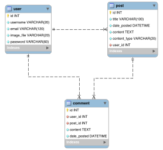

The code available in this repository was include:
- Selection of rendering mode of the posts (HTML, Markdown)
- Addition of comments to posts
- Addition of an [API](./flaskblog/routesapi.py) to consume the posts through REST
- Integration test [routines](test/integration_test.py) (requires selenium)
- WebService test [routines](test/webservice_test.py)




## Installation and execution

Once you have Anaconda installed, in your terminal, run:

```conda create --yes --name simpleblog python=3.8```

Then, you should activate the environment:

```conda activate simpleblog```

Then, install the dependencies:

```pip install -r requirements.txt```

Then, create the database and insert a few examples:

```python load_database.py```

Then, you can run the project:

```python run.py```

Optionally, you can run the tests.
 
First, make sure that the system is running and that selenium is correctly installed in your Chrome browser.
 
Then, open a new terminal and executing:

```pytest```

